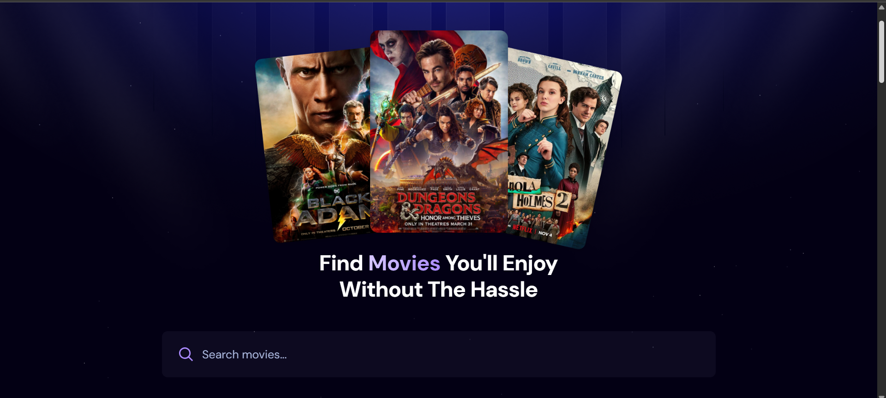
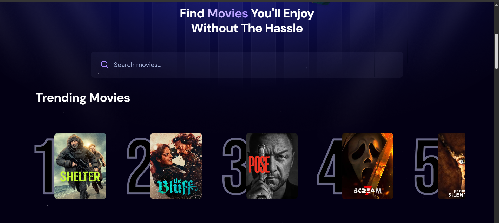
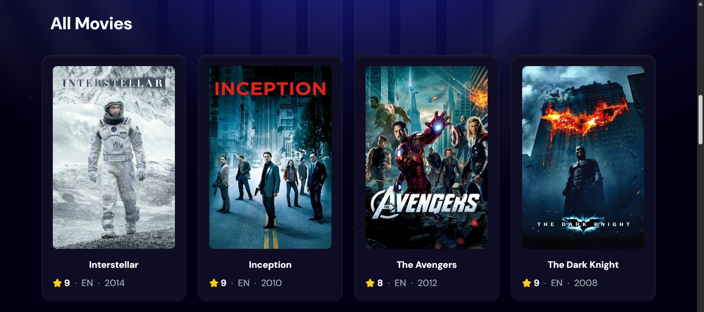

# 🎬 Movie Catalog Site

A modern **Movie Catalog Web Site** built using **React + Tailwind CSS** that allows users to search for movies, view trending movies, and explore a collection of popular films using data from **The Movie Database (TMDB) API**.

This project demonstrates concepts such as **React Hooks, API integration, debounced search, reusable components, and responsive UI design**.

---

##  Features

- 🔎 **Search Movies**
  - Search movies by title using TMDB API.

- ⏳ **Debounced Search**
  - Prevents excessive API calls by delaying search requests.

- 📈 **Trending Movies Section**
  - Displays the top trending movies based on popularity.

- 🎥 **Movie Cards**
  - Shows movie poster, rating, language, and release year.

- ⏳ **Loading Spinner**
  - Displays a spinner while fetching movie data.

- ⚠️ **Error Handling**
  - Shows user-friendly error messages if API requests fail.

- 📱 **Responsive UI**
  - Built with Tailwind CSS for a modern responsive design.

---

# 🛠 Tech Stack

- **React**
- **Tailwind CSS**
- **Vite**
- **TMDB API**
- **React Hooks**
  - `useState`
  - `useEffect`
  - `useRef`
- **react-use**
  - `useDebounce`

---

# 📂 Project Structure


My Movie Site\
│\
├── public\
│ ├── hero.png\
│ ├── hero-bg.png\
│ ├── logo.png\
│ ├── no-movie.png\
│ ├── search.svg\
│ └── star.svg\
│\
├── src\
│ ├── components\
│ │ ├── Header.jsx\
│ │ ├── Movie_section.jsx\
│ │ ├── Movie.jsx\
│ │ ├── Search.jsx\
│ │ ├── Spinner.jsx\
│ │ └── Trending.jsx\
│ │\
│ ├── App.jsx\
│ ├── App.css\
│ ├── index.css\
│ └── main.jsx\
│\
├── .env.local\
├── index.html\
├── package.json\
└── README.md


---

# ⚙️ Environment Setup

This project requires a **TMDB API key**.

Create a `.env.local` file in the root directory:


VITE_TMDB_API_KEY=your_tmdb_api_key


You can get your API key from:

👉 https://www.themoviedb.org/

---

# 📦 Installation

Clone the repository:

```bash
git clone https://github.com/yourusername/movie-catalog.git
```

Move into the project folder:
```
cd movie-catalog
```

Install dependencies:
```
npm install
```
Start the development server:
```
npm run dev
```

---
## 📸 Screenshots




---
## 🧠 Key Concepts Used

## Debounced Search

The app uses useDebounce from react-use to delay API calls while typing.
```
useDebounce(() => {
  setDebouncedSearchTerm(searchTerm);
}, 1000, [searchTerm]);
```
This prevents sending API requests on every keystroke.

---
## Fetching Movies

Movies are fetched from the TMDB API using fetch inside useEffect.
```
const endpoint = query
  ? `${api_base_url}/search/movie?query=${encodeURIComponent(query)}`
  : `${api_base_url}/discover/movie?sort_by=vote_count.desc`;
```
---
## Auto Scroll to Results

When a user searches for a movie, the page automatically scrolls to the All Movies section.
```
allMoviesRef.current?.scrollIntoView({
  behavior: "smooth",
  block: "start"
});
```
---
## 📚 Learning Goals

This project helped practice:

- React component architecture

- API data fetching

- React hooks

- Debounced search optimization

- Tailwind CSS styling

- Responsive layouts

- Error and loading states

---

## 🔮 Future Improvements

Possible enhancements:

⭐ Add movie details page

❤️ Add favorites/watchlist

🎭 Filter movies by genre

📅 Filter by release year

🌙 Dark/light theme toggle

---

## 👨‍💻 Author

Sri Vikas

Frontend Developer | React Learner

Connect with me on LinkedIn.

---

⭐ Support

If you like this project, please give it a star ⭐ on GitHub.

---