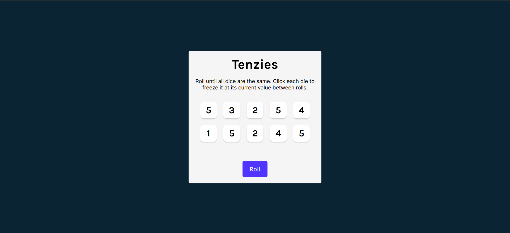
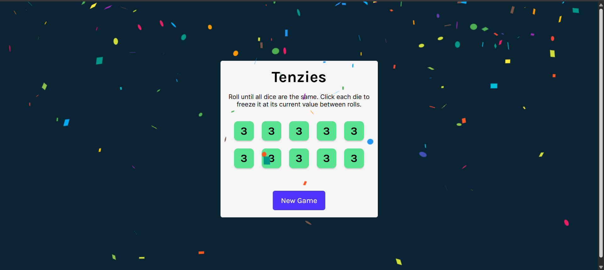

# 🎲 Tenzies Dice Game

This is a React-based dice game built with **Vite**. The goal is to roll the dice until all dice show the same number. Players can hold dice to freeze their value between rolls.




🌐 **Live Demo:** [Tenzies Game](https://tenzies-dice-game-sky.netlify.app/)

---

## ✨ Features

- 🎯 Win detection logic with confetti celebration
- 🎲 Dice roll and hold functionality
- ♿ Accessible with screen-reader support
- 🎨 Custom styles and responsive layout
- ⚡ Built with Vite for blazing fast development

---

## 🛠️ Tech Stack

- React 18
- Vite
- Nanoid (for unique IDs)
- React Confetti
- JavaScript (ES6+)
- CSS (custom styling)

---

## 🚀 Getting Started

### 1. Install Dependencies

```bash
npm install
```
### 2. Run the App Locally
```bash
npm run dev
```
Your app will be running at: http://localhost:5173

---
### 🧪 Project Structure

Tenzies_Game/\
├── public/\
├── images/\
│   └── site_1.png\
├── src/\
│   ├── App.jsx\
│   ├── Die.jsx\
│   ├── index.jsx\
│   ├── index.css\
│   └── ai.js (if any)\
├── index.html\
├── vite.config.mjs\
├── package.json\
├── README.md\
└── dist/ (build output)\

---
📄 License
This project is built for educational purposes. Feel free to modify and use it as you like.

