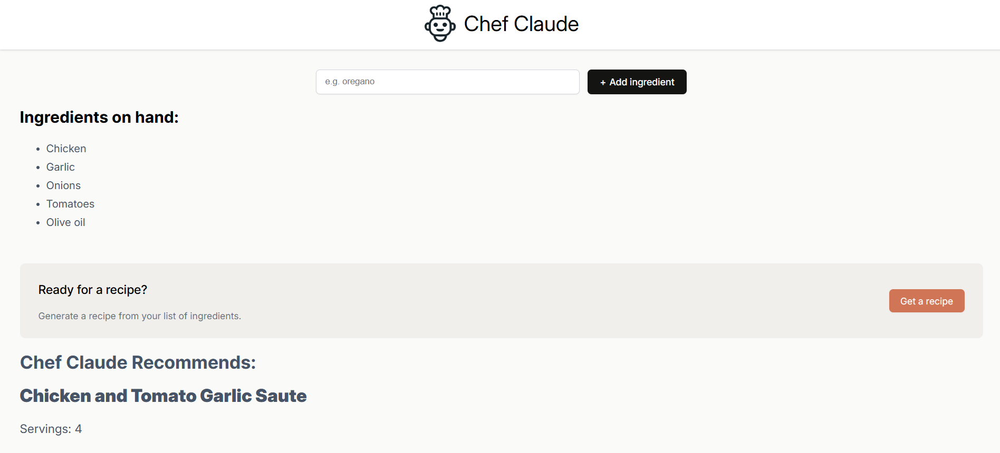
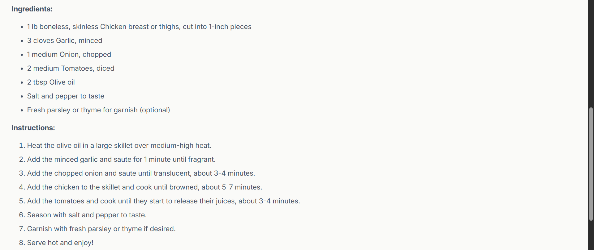

# 🍽️ AI Chef Recipe App

This is a React-based recipe suggestion app built with **Vite**. It uses an AI model to generate a recipe based on the ingredients you input.

🌐 **Live Demo:** [Chef Claude Recipe Maker](https://chef-claude-recipe-maker.netlify.app/)

---

## ✨ Features

- Add ingredients dynamically
- AI-generated recipe (via `getRecipeFromGroq`)
- Component-based design (IngredientsList, ClaudeRecipe)
- Built with Vite for fast development

---

## 🛠️ Tech Stack

- React 18
- Vite
- React Markdown
- JavaScript (ES6+)
- CSS (custom styles)

---

## 🚀 Getting Started

### 1. Install Dependencies

npm install

### 2. Run the App

npm run dev
Your app will be running at http://localhost:5173 (or whichever port Vite chooses).

### 🧪 Project Structure

chef/\
├── public/\
├── src/\
│   ├── components/\
│   │   ├── ClaudeRecipe.jsx\
│   │   └── IngredientsList.jsx\
│   ├── ai.js\
│   ├── App.jsx\
│   ├── Main.jsx\
├── images/\
│   └── chef-claude-icon.png\
├── .env     
├── index.html\
├── vite.config.js\
├── package.json\
└── README.md

### 📄 License
This project is for learning purposes. Modify and use it freely.

