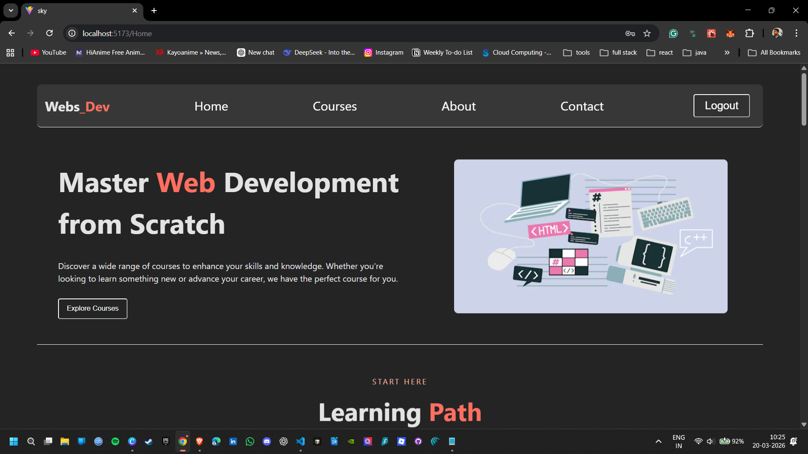

# Webs_Dev Course Site


A full-stack course platform built with React, Vite, and Express.

Webs_Dev is a learning-based web development course site where users can explore courses, projects, and testimonials through a clean frontend, while protected routes and admin login are handled through a custom Express backend.

## Live Preview

Add your deployed link here once the project is live:

```txt
Frontend:
Backend:
```

## Preview



## Features

- Multi-page React app with Home, Courses, About, Contact, and Login pages
- Protected routes using JWT authentication
- Express backend with login endpoint and data endpoints
- Course, project, and testimonial data served from a JSON file
- Course filtering based on level
- Auto logout when token expires
- Reusable components and custom fetch hook

## Tech Stack

### Frontend

- React
- React Router DOM
- Vite
- CSS
- React Icons

### Backend

- Node.js
- Express
- CORS
- JSON Web Token
- bcryptjs

## Folder Structure

```text
course_site/
|- pages/               # page-level components
|- public/              # static files and images
|- server/              # express backend
|- src/
|  |- assets/           # old asset exports / references
|  |- components/       # reusable UI components
|  |- data/             # local data files
|  |- utils/            # auth helper functions
|  |- App.jsx
|  |- App.css
|  |- config.js
|  |- index.css
|  `- main.jsx
|- index.html
|- package.json
`- README.md
```

## Getting Started

### 1. Clone the repository

```bash
git clone <your-repo-url>
cd course_site
```

### 2. Install frontend dependencies

```bash
npm install
```

### 3. Install backend dependencies

```bash
cd server
npm install
cd ..
```

## Environment Variables

Create a `.env` file in the project root for the frontend:

```env
VITE_AUTH_API_URL=http://localhost:5000
VITE_DATA_API_URL=http://localhost:5000
```

Create a `.env` file inside the `server` folder for backend auth:

```env
PORT=5000
ADMIN_EMAIL=your-email@example.com
ADMIN_PASSWORD_HASH=your-bcrypt-hash
JWT_SECRET=your-secret-key
```

## How To Generate Password Hash

If you want to create a bcrypt password hash for `ADMIN_PASSWORD_HASH`, run this inside the `server` folder:

```bash
node -e "console.log(require('bcryptjs').hashSync('yourPasswordHere', 10))"
```

## Run Locally

### Start the backend

```bash
cd server
npm start
```

### Start the frontend

Open another terminal in the project root:

```bash
npm run dev
```

Default local URLs:

- Frontend: `http://localhost:5173`
- Backend: `http://localhost:5000`

## Available Scripts

### Frontend

- `npm run dev` starts the Vite development server
- `npm run build` creates the production build
- `npm run preview` previews the production build locally
- `npm run lint` runs ESLint

### Backend

- `npm start` starts the Express server

## Authentication Flow

1. User logs in from the frontend login page.
2. Frontend sends credentials to the backend `/login` route.
3. Backend checks the admin email and hashed password.
4. If valid, backend returns a JWT token.
5. Frontend stores the token in `localStorage`.
6. Protected routes only render when the token is valid.
7. User is automatically logged out when the token expires.

## API Endpoints

| Method | Route | Purpose |
|--------|-------|---------|
| GET | `/` | Check if backend is running |
| GET | `/courses` | Get course data |
| GET | `/projects` | Get project data |
| GET | `/testimonials` | Get testimonial data |
| POST | `/login` | Validate admin login and return JWT |

## Notes

- Course, project, and testimonial data currently come from `src/data/courseDb.json`
- The contact form is currently frontend-only
- Some older local data files are still present for reference
- JWT expiry is currently set to 5 minutes

## Future Improvements

- Connect the contact form to a real backend or email service
- Add a real database instead of local JSON data
- Build an admin dashboard to manage courses
- Add signup flow and user roles
- Improve validation and error handling
- Deploy frontend and backend online

## Author

Sri Vikas
