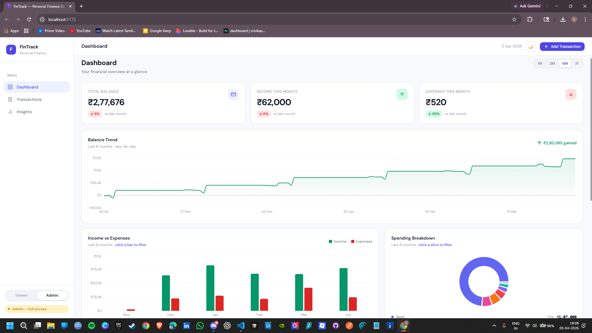
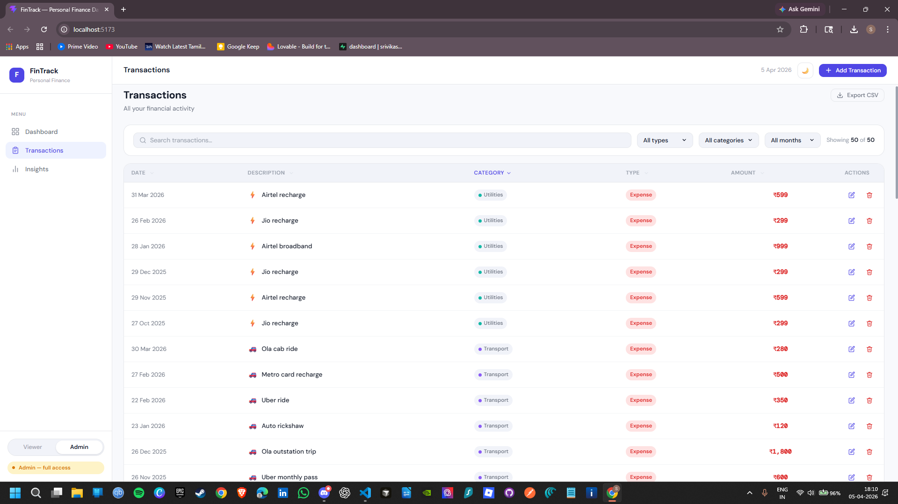
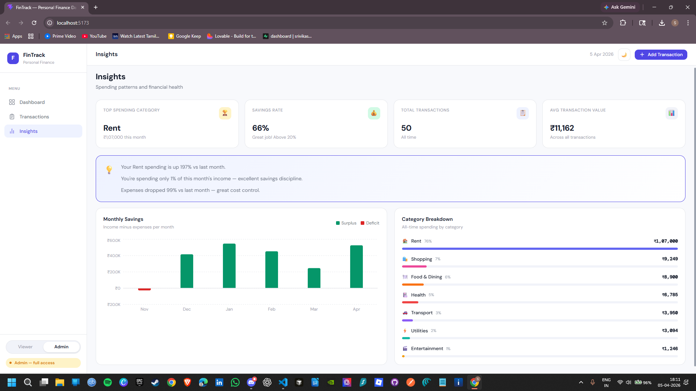

# FinTrack — Personal Finance Dashboard

A clean, interactive personal finance dashboard built with React. Track income and expenses, explore spending patterns, drill into charts, and manage transactions — all in the browser with no backend required.

---

## Screenshots

**Dashboard — light mode**


**Transactions**


**Insights**


---

## Quick Start

```bash
# Install dependencies
npm install

# Start dev server
npm run dev
# → http://localhost:5173

# Production build
npm run build
npm run preview
```

**Requirements:** Node 18+

---

## Features

### Dashboard
- **Summary cards** — Total Balance, Income This Month, Expenses This Month with % change badge vs the previous month
- **Count-up animation** — numbers animate from 0 on first render
- **Date range selector** — 1M / 3M / 6M / 1Y pill toggle in the header; all three charts update simultaneously
- **Balance Trend** — full-width AreaChart showing the running account balance day-by-day across the selected range; gradient fill turns green/red based on trend direction; trend badge shows ₹ gained/lost
- **Income vs Expenses** — grouped BarChart across the selected range; click any bar to jump to Transactions filtered to that month
- **Spending Breakdown** — donut chart of expenses by category for the selected range; click any slice to drill into Transactions; custom legend with % share and ₹ amount
- **Recent Transactions** — last 5 entries with emoji icons; "View all →" navigates to Transactions

### Transactions
- **Responsive layout** — full table on desktop; card-per-row layout on mobile (≤600px)
- **Text search** — matches description and category live
- **Filters** — Type, Category, Month dropdowns; mobile layout places all 3 in a single row
- **Sortable columns** — click any header to sort asc/desc
- **Clear button** — resets all active filters in one click
- **Result count** — "Showing X of Y" updates live
- **Chart drill-through** — navigating from a dashboard chart pre-filters the list automatically
- **Export CSV** — downloads the current filtered view (available to both roles)
- **Undo delete** — deleting a transaction shows a 4-second toast with an Undo button; no confirm dialog

### Insights
- **KPI cards** — Top spending category, Savings rate, Total transactions, Average transaction value
- **Monthly Savings chart** — bars coloured green (surplus) or red (deficit); ReferenceLine at zero
- **Category Breakdown** — CSS progress bars ranked by spend; no chart library
- **Observation card** — 2–4 auto-generated plain-English insights based on your data

### Role-based UI

| Feature | Viewer | Admin |
|---|---|---|
| View all pages | ✓ | ✓ |
| Export CSV | ✓ | ✓ |
| Add transaction | — | ✓ |
| Edit transaction | — | ✓ |
| Delete transaction | — | ✓ |

The role toggle slider is at the bottom of the sidebar. Switch between Viewer and Admin instantly — the role persists across page refreshes.

### Other
- **Dark mode** — toggle button in the top-right header; full theme switch via CSS custom properties; persisted in localStorage
- **Responsive** — works at 375px (mobile cards), 768px (sidebar drawer), and 1280px+ (full layout)
- **localStorage persistence** — transactions, role, and theme all survive a page refresh
- **Animations** — `fadeInUp` entrance with staggered delays; `bar-grow` on category ranking bars

---

## State Management

All state lives in a single `AppContext` powered by `useReducer`. No Redux, Zustand, or external library.

```js
{
  transactions: [],        // persisted to localStorage
  role: 'viewer',          // 'viewer' | 'admin' — persisted
  theme: 'light',          // 'light' | 'dark' — persisted
  currentPage: 'dashboard',
  dashboardRange: 6,       // 1 | 3 | 6 | 12 months
  filters: { search, type, category, month },
  sortConfig: { column, direction },
  modalState: { isOpen, mode, editId },
  lastDeleted: null,       // { tx, index } for undo
  toast: null              // { message, type, undoable? } | null
}
```

**Derived state via hooks — nothing computed is stored in the reducer:**

| Hook | Computes |
|---|---|
| `useTransactions` | Filtered + sorted transaction list |
| `useAnalytics` | Monthly totals, balance trend, category breakdown, KPIs, savings rate, observation strings |

---

## Project Structure

```
src/
  context/
    AppContext.jsx        createContext + Provider
    reducer.js           14 action handlers
    initialState.js      state shape + localStorage seed
  data/
    mockTransactions.js  50 realistic Indian ₹ transactions across 6 months
    categories.js        11 categories with CSS variable + hex colours + emojis
  hooks/
    useAppContext.js      guarded context hook
    useTransactions.js   filtered + sorted list via useMemo
    useAnalytics.js      all computed financial metrics
  utils/
    formatters.js        formatINR, formatDate, formatMonth, formatPct, formatINRShort
    analytics.js         getMonthlyTotals, getCategoryBreakdown, getBalanceTrend, getUniqueMonths
    exportCSV.js         Blob URL CSV download
  components/
    layout/              Layout, Sidebar, Header
    dashboard/           SummaryCards, BalanceTrendChart, MonthBarChart,
                         SpendingPieChart, RecentTransactions, RangeSelector
    transactions/        FilterBar, TransactionTable, TransactionRow,
                         TransactionCard, SortableHeader
    insights/            InsightKPIs, SavingsBarChart, CategoryRanking, ObservationCard
    shared/              Modal, TransactionForm, TransactionModal,
                         Badge, EmptyState, Toast, Dropdown
  pages/
    Dashboard.jsx
    Transactions.jsx
    Insights.jsx
  styles/
    index.css            CSS custom properties, reset, dark mode tokens
    layout.css           sidebar, header, page grids
    components.css       cards, badges, buttons, table, form, modal, toast, charts
    animations.css       fadeInUp keyframes + stagger classes
    responsive.css       breakpoints: 1024px, 768px, 600px
```

---

## Tech Stack

| Tool | Why |
|---|---|
| **React 18 + Vite** | Fast HMR, modern JSX transform |
| **Plain CSS + Custom Properties** | Full dark mode control, no runtime overhead, demonstrates CSS depth |
| **Context API + useReducer** | Right-sized for a 3-page app — no Redux boilerplate |
| **Recharts** | Declarative SVG charts; AreaChart, BarChart, PieChart |
| **localStorage** | Persistence with ~10 lines per slice |

No UI component library — every component is hand-built. No routing library — page switching via `currentPage` in state.

---

## Design Decisions

**Indian ₹ locale throughout** — all numbers formatted with `Intl.NumberFormat('en-IN', { currency: 'INR' })`. Mock data uses Swiggy, Zomato, Ola, HDFC SIP, Zerodha etc.

**No inline CSS** — all styles live in `.css` files. Dynamic values (colours from data, widths from percentages) are passed as CSS custom properties (`style={{ '--bar-color': hex }}`) and consumed in CSS (`background: var(--bar-color)`). Boolean state variations use class modifiers (`.summary-card__value--negative`).

**Two colour maps per category** — `CATEGORY_COLOR` uses CSS variables (for HTML/CSS contexts), `CATEGORY_HEX` uses hex strings (for Recharts SVG, which cannot resolve CSS variables).

**`useAnalytics` as the single source of computed truth** — monthly totals, balance trend, category breakdowns, savings rate, KPIs, and observation strings all derived in one `useMemo`. No risk of components computing the same value differently.

**Chart drill-through** — `SET_PAGE` no longer clears filters (sidebar navigation calls `CLEAR_FILTERS` explicitly before navigating). This allows charts to set a filter then navigate in two separate dispatches without the second wiping the first.

**Undo delete** — reducer stores `lastDeleted: { tx, index }` on `DELETE_TRANSACTION`. `UNDO_DELETE` splices it back at the original index. `HIDE_TOAST` clears `lastDeleted` when the 4-second window expires.

**CSS-only animations** — `fadeInUp` with stagger delay classes (`stagger-1` through `stagger-8`) — no Framer Motion.

---

## Known Limitations

- **No backend** — data is mock-seeded and stored in localStorage. Clearing browser storage resets to 50 mock transactions.
- **No real authentication** — role switching is a UI demo, not a security boundary.
- **Single currency** — hardcoded to Indian Rupees (₹).
- **No pagination** — 50 transactions render fine; pagination would be needed at ~500+ rows.
