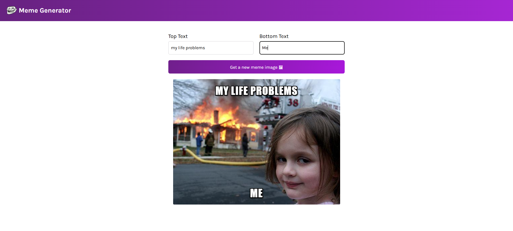

# 😂 Meme Generator App

A fun and responsive meme generator built using **React** and **Vite**. You can input custom top and bottom texts, and generate random meme images from the [Imgflip API](https://api.imgflip.com/).

🌐 **Live Demo:** [Meme Generator](https://meme-generator-flip.netlify.app/)  
📦 **Built With:** Vite + React

---

## ✨ Features

- 🔀 Random meme image generation from a public API
- 🖊️ Customizable top and bottom meme text
- ⚡ Fast development with Vite
- 🎨 Clean UI with styled components and CSS
- 💡 Responsive design for mobile and desktop

---

## 🛠️ Tech Stack

- React 18
- Vite
- JavaScript (ES6+)
- CSS3

---

## 🚀 Getting Started

### 1. Install Dependencies

npm install

### 2. Run the App

npm run dev\
Your app will be running at http://localhost:5173 (or whichever port Vite chooses).

---

### 🧪 Project Structure

meme_generator/\
├── components/\
│   ├── Header.jsx\
│   └── Main.jsx\
├── images/\
│   └── troll-face.png\
├── index.html\
├── index.jsx\
├── index.css\
├── App.jsx\
├── package.json\
├── vite.config.mjs\
└── README.md

---

### 📄 License
This project is for learning purposes. Modify and use it freely.

---
