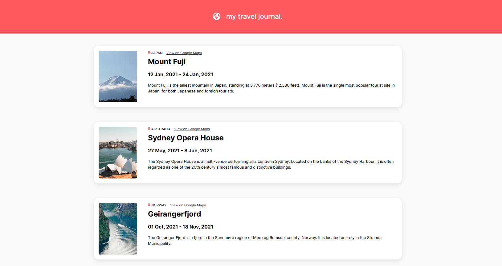

# 🌍 Travel Journal

A responsive web application to document and showcase travel destinations using React. Users can see a collection of beautiful locations, their descriptions, dates visited, and a link to view them on Google Maps.

---

## 🖼️ Preview

 <!-- Replace with your actual screenshot path -->

---

## 📌 Features

- 🌐 List of travel destinations with images
- 📍 Location and Google Maps integration
- 📅 Date of travel
- ✍️ Brief description of each place
- 💻 Clean, responsive, card-based layout with shadows and rounded corners
- 🧭 Simple and modern design with mobile-first styling

---

## 🛠️ Tech Stack

- **React** (Vite or CRA)
- **HTML5 & CSS3**
- **JavaScript (ES6+)**
- **Custom CSS** 


# Getting Started
Install the dependencies and run the project
```
npm install
npm start
```
✨ Contributing
Pull requests are welcome! If you'd like to suggest improvements, feel free to fork the repo and create a PR.

📄 License
This project is open source and available under the MIT License.
---
Let me know if you'd like to add deployment links, Tailwind, animations, or GitHub Actions badges — I can update the README accordingly.
---

Happy Coding!